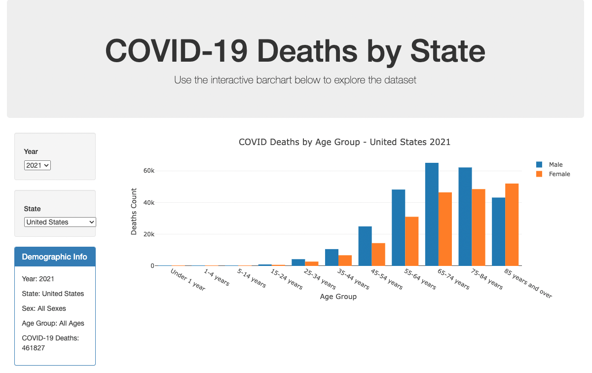
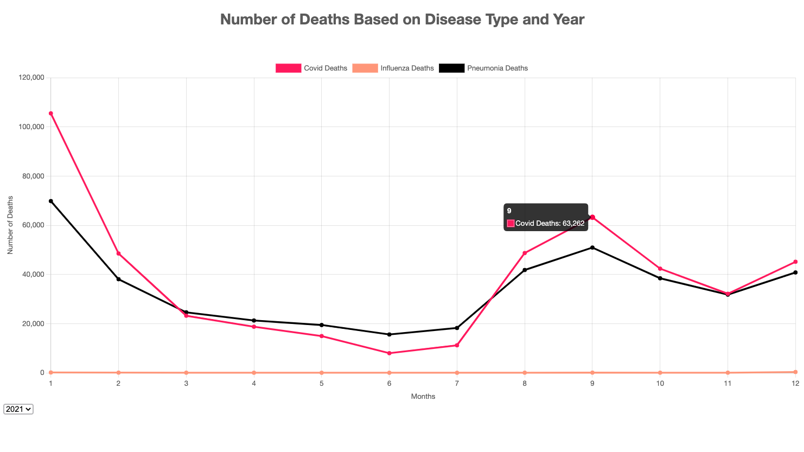

# COVID-19 Interactive Web Page 
Interactive dashboard built to explore COVID-19 death rate statistics in the United States.

## Table of Contents
* [General Info](#general-information)
* [Technologies Used](#technologies-used)
* [Featured Notebooks and Files](#featured-notebooks-and-files)
* [Screenshots](#screenshots)
* [Data Source](#data-source)
* [Conclusions](#conclusions)

## General Information
This project examines COVID-19 statistics from the United States through an interactive dashboard. Data is visualized in a choropleth map to view states with the high death toll from COVID, allowing the user to click on a state for more information. Additionally, COVID dashboards created a barchart to view deaths by age and filtered by state as well as comparative linegraphs using COVID, Influenza and Pneumonia data from 2020-2022. 

## Technologies Used
- d3.js
- chart.js
- Leaflet.js
- Plotly.js
- Flask
- Python
- MongoDB
- HTML
- CSS
- Javascript
 
 ## Featured Notebooks and Files

The structure of the project includes the following folders/files: 

* templates - including all the main html files: index, dashboard, home, contact, index-scraped, map, barchart and linegraph html files
* static - including CSS folder and JS folder 
* blog - including all the supportmental html files
* Resources - including covid-19 deaths by sex and age and population csv files
* images - including all the screenshots and pictures used for project 
* app.py - main Flask app
* covid_data.py -  scraped app

 
## Screenshots

DashBoard

Choropleth Map 

Barchart

Linegraph

## Data Source

. cdc.gov

. kaggle.com

JSON data accessed from:

MongoDB uri="mongodb://localhost:27017/covid_app"

## Conclusions and Considerations for Further Analysis
Our work seeks to provide insights into the spread of COVID-19 across age groups, gender, and location in the United States. Analysis of the death rate pre/post vaccine roll out, comparing Covid deaths, Influenza deaths and Pneumonia deaths to find out relationship in similar diseases, and potential for machine learning models to predict COVID death risk based on an individual's demographics are all areas for potential exploration.
